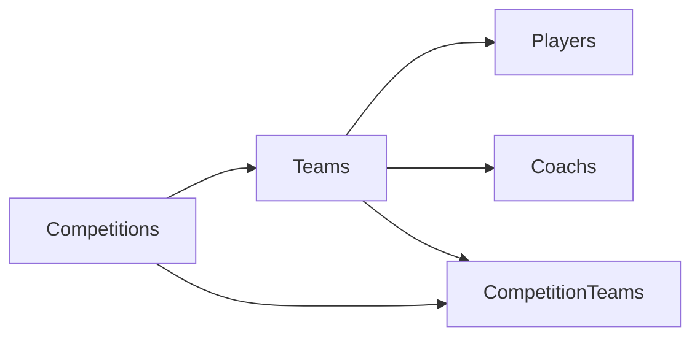

# Welcome to my challenge - SantexGroup!

## Importante
**No es necesario ejecutar el script de base de datos**, la base de datos se encuentra alojado en un servidor público.
> Sólo si desean ejecutar la base de datos localmente deben usar el *[script](https://github.com/agavidiad/be-challenge-agavidia/blob/main/Database%20Scripts%20-%20Optional/MSSQL%20Challenge-SantexGroup.sql)*. 
> Después configurar los accesos en el archivo *[.env](https://github.com/agavidiad/be-challenge-agavidia/blob/main/Backend.Node.Football/.env)* 

## Database

## Pasos para ejecutar los servicios REST API localmente

1. Tener instalado NODE versión v16.
2. Abrir proyecto backend carpeta: **Backend.Node.Football** (Usar el IDE de su preferencia) 
3. Ejecutar el comando: `npm install`
4. Optional: Instalar nodemon `npm install -g nodemon`
5. Ejecutar comando: `node index` o `nodemon index`
6. Ruta por defecto es: http://localhost:3000/
7. Abrir postman y ejecutar las llamadas a los servicios REST API

## Endpoints
**GET Reset Database**
- Sirve para eliminar todos los registros de la base de datos
>http://localhost:3000/importLeague/reset/all

**1. GET Importar Liga**
- El último parámetro es el **código de Liga/Competition** ejemplos:
> http://localhost:3000/importLeague/CLI

> http://localhost:3000/importLeague/ELC
- Si es satisfactorio devuelve: `{"status": 200,"message": "OK"}`
- Si es un código inválido devuelve: 
`{"statusCode": 404, "error": "Not Found", "message": "No existe el código" }`

**2. GET Importar Todas las Ligas/Competencias**
- El último parámetro es **opcional** podemos pasarle la cantidad de ligas que necesitamos importar:
> **Si excedemos la cantidad de peticiones 10 (Límite REST API Football) este servicio ejecuta una pausa de 1 minuto y continua con la petición**

> http://localhost:3000/importLeague/import/all

> http://localhost:3000/importLeague/import/all/10 *dependiendo de la cantidad la llamada a este servicio podría demorar minutos*
- Si es satisfactorio devuelve: `{"status": 200,"message": "Se importaron X ligas/competitions"}`

**3. GET Obtener jugadores por Liga**
> http://localhost:3000/players/CL *devuelve los jugadores de una liga CL, WC, ETC*

> http://localhost:3000/players/CL/milano *filtra por team*

> http://localhost:3000/players/CL/Correa *filtra nombre de jugador*

**4. GET Obtener team**
> http://localhost:3000/teams/paris *obtener sólo información del team*

> http://localhost:3000/teams/paris/players *obtener información del team, players y/o coaches*

**5. GET PLAYERS BY TEAM**
- http://localhost:3000/players/teams/346/players se le pasa el id del team

# GRACIAS - SantexGroup!
